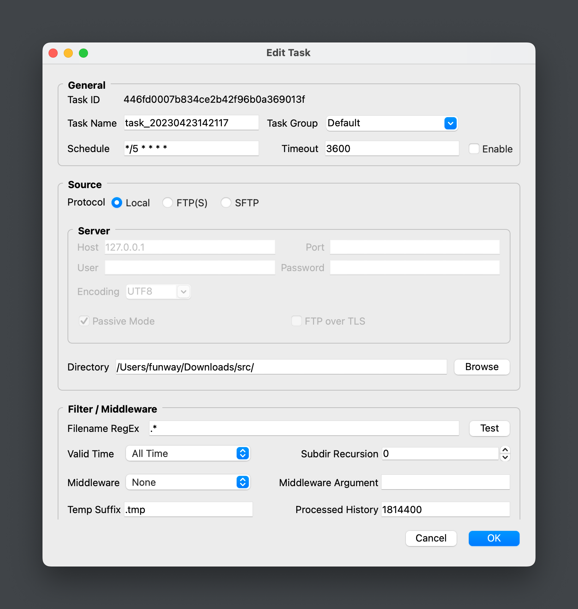

# TransferDog Manual

<aside>
💡 **TransferDog** 是一个用 Python 语言编写的文件传输程序。它可以帮你定时地从源地址收集文件，并发送到目标地址。源与目标地址可以是本地目录，也可以是 FTP, FTPS, SFTP 服务器。

</aside>

# ⭐ ****Getting Started****

## 运行程序

### 从源码运行

如果你下载的 TransferDog 的源码，你可以使用命令行 `python main.py` 来运行本程序。

在运行程序之前，你需要确保：

1. Python 版本 ≥ 3.10
2. 安装 requirements.txt 文件里要求的依赖库。可以使用命令 `pip install -r requirements.txt` 进行安装。

### 从打包版本运行

如果你下载的是 TransferDog 已经打包好的版本，我们已经将 Python 运行环境以及依赖库都打包进项目目录中了。

你可以直接双击目录下的 main 文件 (Windows 平台是 main.exe 文件) 运行 TransferDog 程序。

## 程序界面

### 主窗口


主窗口包括：

1. 菜单栏，显示菜单。包括 新建任务，编辑任务，复制任务，删除任务，启动任务，停止任务，打开源目录，打开目标目录，打开任务日志，打开任务处理记录，打开帮助文件。
2. 任务列表，显示所有传输任务，可以通过任务列表顶部的搜索条来筛选任务。
3. 处理记录，显示当前在任务列表中选中任务的处理记录。
4. 状态栏，显示程序运行状态与错误信息。

### 任务编辑窗口



当新建、编辑、复制任务时候，都会弹出任务编辑窗口。任务编辑窗口包括:

- General 组
    
    设置任务名字，任务组，任务调度规则（使用 Crontab 表达式），任务超时时间，以及是否启用任务。
    
- Source 组
    
    设置任务的源地址。
    
- Filter / Middleware 组
    
    设置任务的源文件名匹配规则，源文件有效时间，子目录递归，中间件，文件传输的临时后缀，处理记录的保留时长。
    
- Destination 组
    
    设置任务的目标地址。
    

### 正则测试窗口


在任务编辑窗口的源文件名正则表达式后面， 有一个测试按钮，可以打开正则测试窗口。你可以使用该窗口进行正则表达式的测试。

在 Input 栏输入待匹配的文件名，每行一个。在 RegEx 栏输入你的正则表达式。点击 start 按钮，即可在 Output 栏输出该正则表达式匹配到的文件名。

## 任务调度

<aside>
💡 TransferDog 主程序会一直轮询任务列表，并根据每个任务自身配置的任务计划与超时时间来启动、中止任务。TransferDog 采用子进程的方式来运行任务，而不是线程方式。

</aside>

### 主程序的调度逻辑

1. 轮询任务列表。
2. 如果一个任务到了执行时间点，则启动任务**子进程**(即 worker 进程)。
3. 如果检测到任务超时，则主动 kill 任务子进程。
4. 如果主程序退出，任务子进程会自动检测到父进程已死并中止自身运行。

### 任务计划

1. TransferDog 对于每个任务的运行计划，采用的是 Linux 平台通用的 crontab 表达式。即用 `* * * * *` 表达 `分 时 日 月 周几`。
2. crontab 示例：
    1. `*/5 * * * *` 表示每5分钟运行
    2. `2 4 * * mon,fri` 表示每周一、周五的04:02运行
3. 由于采用了 [croniter](https://github.com/kiorky/croniter) 库，TransferDog 的 crontab 表达式也支持在第六位设置秒。比如 `* * * * * */5` 表示每5秒钟运行一次。
4. 推荐一个在线测试 crontab 表达式的网站：[https://crontab.guru/](https://crontab.guru/)

## 过滤与中间件

### 正则匹配

<aside>
💡 对源文件的正则匹配，默认是匹配源文件全路径名的。即 `/path_to_file/filename.txt` 这一整个路径。所以建议使用 `$` 号来匹配结尾。

</aside>

### 中间件

<aside>
💡 TransferDog 引入了中间件的概念，用来修改文件的收集（下载）与发送（上传）逻辑。

</aside>

1. 程序默认只提供了 example.py 与 init_processed.py 两个中间件模块。
2. 你可以在项目的 `plugin/middleware/` 目录下找到这两个模块文件。
3. example.py 中间件什么都不做，就是给你看源码用的。
4. init_processed.py 中间件在源文件被过滤之后、下载之前接管执行逻辑。放弃下载与上传文件，但将该文件写入处理记录。你可以用它来初始化一个任务，如果它的源目录下有太多文件，而你又不想下载这些过期文件。
5. 你可以编写自己的中间件模块，放在 `plugin/middleware/` 目录下。只要它符合我们对中间件的格式要求（请参考 example.py 中间件）。

# 💻 代码框架

<aside>
💡 TransferDog 代码主要由两个模块组成: transfer_dog 与 transfer_worker。

</aside>

## 概述


项目目录结构

- main.py
    
    程序 GUI 的入口文件，调用 transfer_dog 模块。
    
- worker.py
    
    传输程序（任务子进程）的入口文件，调用 transfer_worker 模块。
    
    worker 可以独立于 GUI 运行。你可以执行 `python worker.py -h` 查看它的命令行参数。
    
- transfer_dog/
    
    该模块负责应用程序的 GUI，以及任务调度。
    
- transfer_worker/
    
    该模块负责实际执行传输任务。
    
- conf/
    
    配置文件所在的目录。包括日志配置与任务配置。
    
    配置文件均采用 UTF8 编码，在 Windows 环境下编辑修改配置文件时需要留意这点。
    
- designer/
    
    保存 Qt Designer 生成的 UI 设计文件。
    
- log/
    
    日志目录。
    
- plugin/
    
    插件目录。用来扩展传输程序的中间件模块。
    
- processed/
    
    保存任务处理记录的目录。每个任务处理记录文件(我们叫它 processed_db)，都对应着一个传输任务，并以相应任务的 uuid 命名。
    
    每个 processed_db 文件都是一个 SQLite 数据库，保存着对应传输任务已经处理过的源文件信息。
    
- test.py, pytest.ini, pytests/
    
    单元测试文件。
    
- requirements.txt
    
    依赖库要求。
    
- linux.spec, macOS.spec, win64.spec
    
    不同操作系统的 pyinstaller 打包配置文件。
    

## transfer_dog 模块

transfer_dog 模块是程序的 GUI 框架，主要负责：

1. 增删查改传输任务。
2. 启动、停止任务。
3. 显示任务运行状态，处理记录。
4. 根据任务的 schedule 定时调度任务，启动任务子进程。

## transfer_worker 模块

transfer_worker 模块负责传输任务的实际执行，它可以独立于 transfer_dog 模块单独运行。

### 执行逻辑

- Getter 对象负责过滤与下载源文件，生成 MiddleFile 对象。
- MiddleFile 对象负责保存临时文件的状态。包括临时文件本身，以及对应的源文件路径、目标文件路径。
- Putter 对象负责上传 MiddleFile 临时文件，生成目标文件。
- middleware 中间件负责对 MiddleFile 进行中间过程的处理。可以通过 middleware 改变文件下载/上传的逻辑。

worker 的整个执行过程可以简化为：

<aside>
💡 Getter 过滤 > middleware.pre_process 预处理 > Getter 下载 > middleware.process 后处理 > Putter 上传

</aside>

详细过程：

1. 任务启动时，先根据源与目标创建对应的 getter 与 putter。并进行有效性检查，异常的直接报错退出。
2. getter.next() 获取下一个待传输文件：
    1. 遍历源目录。
    2. 判断文件更新时间是否小于 interval (constants.IGNORE_MTIME_IN_SECONDS)。
    3. 判断文件名是否匹配正则表达式。
    4. 判断 (源文件, mtime) 是否已存在于 processed_db 数据库中。
    5. 返回一个 mid_file = MiddleFile(源文件路径, 源文件修改时间)，其中源文件路径是相对于任务配置中源地址(task.source.path)的相对路径。
3. middleware.pre_process() 进行预处理。
    
    可以添加无法只使用正则匹配实现的过滤规则，可以用来修改目标文件路径，可以修改 mid_file.abort 属性来指定对源文件是否执行后续处理。
    
4. getter.get() 下载该文件，生成 mid_file.middle 中间临时文件。
    
    如果源文件 size 很小，并不落地生成中间文件，mid_file.middle 指向一个 BytesIO 对象。
    
    如果源文件 size 较大，才落地生成中间文件，mid_file.middle 指向该中间文件的全路径（Path 对象）。
    
    这个标准 size 的值由 constants.MIDDLE_FILE_THRESHOLD 指定。
    
5. middleware.process() 进行后处理。
6. putter.put(mid_file) 将临时文件上传到目标路径。
7. 删除源文件以及清理临时文件。

## middleware 开发

```python
import logging

from transfer_worker.worker.middle_file import Abort, MiddleFile

DESCRIPTION = """中间件示例
你可以通过自己编写的中间件脚本来修改 TransferWorker 的传输逻辑。

有效的中间件应该可选地包含两个函数: pre_process(mid_file, arg) 与 process(mid_file, arg).

你可以在中间件函数中决定目标文件的文件路径，决定是否中止传输，甚至通过 mid_file.middle 修改上传的文件内容。

参数 mid_file 代表处于 下载 >> 上传 中间状态的临时文件。TransferWorker 从源地址下载源文件，形成 mid_file, 然后将 mid_file 上传到目标地址。
    MiddleFile {
        source:         源文件的相对路径, Path 类型
        source_mtime:   源文件的文件修改时间, str 类型
        middle:         临时文件, Path 类型或者字节流类型
        dest:           目标文件的相对路径, Path 类型
        abort:          是否中止后续操作, middle_file.Abort 枚举。包括 Abort.ABORT, Abort.NO_ABORT, Abort.ABORT_AND_RECORD。
                        三个枚举值分别表示 中止、不中止、中止并记录为已处理。默认为 NO_ABORT。
    }

参数 arg 是由任务配置中的 task.middleware_arg 字段传递的。两个函数共享该字段，由你自己决定如何划分该参数。
    比如你可以决定 arg.split(',')[0] 给 pre_process 用， arg.split(',')[1] 给 process() 用。

"""

def pre_process(mid_file: MiddleFile, arg: str) -> None:
    """TransferWorker 在过滤出待处理的源文件之后，准备下载该源文件之前，会尝试调用中间件的 pre_process() 函数。

    此时的 mid_file 只有 {source, source_mtime, abort} 属性
    
    你可以在 pre_process() 中设置 mid_file 的 dest 与 abort 属性

    Args:
        mid_file (MiddleFile): _description_
        arg (str): _description_
    """
    logger = logging.getLogger(__name__)
    logger.debug('Just do nothing.')
    pass

def process(mid_file: MiddleFile, arg: str) -> None:
    """TransferWorker 在下载完源文件，生成 mid_file.middle 之后，准备上传该 mid_file 之前，会尝试调用中间件的 process() 函数。
    
    此时的 mid_file 只有 {source, source_mtime, middle, abort 属性}

    你可以在 process() 中设置 mid_file 的 dest 与 abort 属性。甚至修改 mid_file.middle 临时文件的内容。

    Args:
        mid_file (MiddleFile): _description_
        arg (str): _description_
    """
    logger = logging.getLogger(__name__)
    logger.debug('Just do nothing.')
    pass
```

# 🎁 Thanks to

## Python 第三方库

- [PySide6](https://pypi.org/project/PySide6/) for GUI
- [SQLite](https://www.sqlite.org/index.html) for Database
- [peewee](https://github.com/coleifer/peewee) for ORM
- [Paramiko](https://github.com/paramiko/paramiko) for SFTP
- [croniter](https://github.com/kiorky/croniter) for scheduling task

## 资源文件

- [remixicon](https://remixicon.com/) for Icon
- [flaticon](https://www.flaticon.com/icon-fonts-most-downloaded/2?weight=bold&corner=rounded&type=uicon) for Icon
- [loading.io](https://loading.io/) for GIF

# 📝 Todo list

- [ ]  SFTP 使用的是 Paramiko 库，但是该库目前不支持非 UTF8 编码的服务器
- [ ]  HTTP 下载(上传就不做了，因为 HTTP 上传跟服务器太相关了)
- [ ]  源文件正则匹配，可选匹配全路径还是单单匹配文件名。（现在默认是匹配全路径的）
- [ ]  可选主题