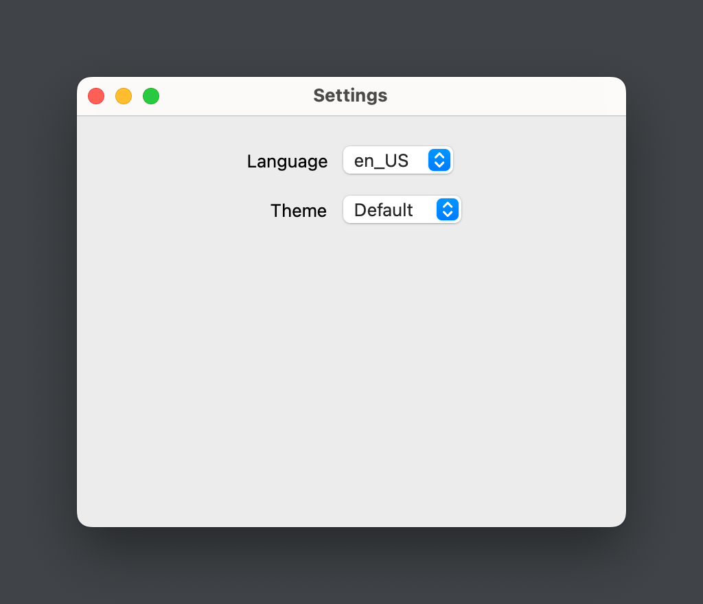

# TransferDog Manual (English)

English / [中文](README_zh.md)

<aside>
💡 **TransferDog** is a file transfer program written in Python. It helps you collect files from a source address and send them to a destination address at regular intervals. The source and destination addresses can be local directories or FTP, FTPS, SFTP servers.

</aside>

# ⭐ ****Getting Started****

## Running Program

### From source code

If you downloaded the source code of TransferDog, you can use the command line `python main.py` to run the program.

Before running the program, you need to make sure:

1. Python version ≥ 3.10
2. You have installed the required dependencies in the `requirements.txt` file. This can be done with the command `pip install -r requirements.txt`.

### From packaged version

If you have downloaded a packaged version of TransferDog, we've packaged the Python runtime environment and dependencies in the project directory.

You can run the TransferDog program by double-clicking on the main file (main.exe on Windows platforms) in the directory.

## Program user interface

### Main window


The main window includes：

1. Tool Bar, which displays the menus. Includes New Task, Edit Task, Copy Task, Delete Task, Start Task, Stop Task, Open Source Directory, Open Destination Directory, Open Task Log, Open Task Processing Record, Setting, Open Help File.
2. Task List, which displays all transfer tasks, and you can filter tasks by the search bar at the top of the task list.
3. Processed Log, displays the processed records of the currently selected task in the task list.
4. Status Bar, displays the running status or error message of the program.

### Task Edit Dialog


The Task Edit Dialog pops up when you click the NewTask, EditTask, or CopyTask button in the Tool Bar, or when you double-click a task in the Task List.

- General Group
    
    Set the task name, task group, task scheduling rules (using Crontab expressions), task timeout, and whether to enable the task.
    
- Source Group
    
    Set the source address of the transfer.
    
- Filter / Middleware Group
    
    Set the task's source file name matching rules, source file expiration time, subdirectory recursion, middleware, temporary suffix for file transfer, and retention time for processed records.
    
- Destination Group
    
    Set the destination address of the transfer.
    

### Regular Expression Testing Dialog


After the source filename regular expression in the Task Edit Dialog, there is a Test button that opens the Regular Expression Testing Dialog. You can use this dialog to test the regular expression.

In the Input field, enter the names of the files to be matched, one filename per line. Enter your regular expression in the RegEx field. Click the start button to output the file names matched by the regular expression in the Output field.

### Settings Dialog



In the Settings Dialog, you could choose the language and theme for the program.

## Task Scheduling

<aside>
💡 The TransferDog’s main process polls the list of tasks all the time and starts or stops them according to each task's own configured task schedule and timeout. TransferDog runs tasks as subprocesses, not as threads.

</aside>

### Scheduling Logic in Main Process

1. Poll the list of tasks.
2. If a task reaches its execution time, start the task **subprocess** (the worker process).
3. if a task timeout is detected, kill the subprocess of this task.
4. If the main process exits, the subprocess automatically detects that the parent process is dead and aborts itself.

### Task Scheduling

1. TransferDog uses the crontab expression common to the Linux platform to schedule each task. That is, `* * * * *` for `minutes, hours, days, months, and days of the week`.
2. crontab example：
    1. `*/5 * * * *` means run every 5 minutes.
    2. `2 4 * * mon,fri` means it runs every Monday and Friday at 04:02.
3. Thanks to the [croniter](https://github.com/kiorky/croniter) library, TransferDog's crontab expression also supports setting seconds in the sixth position. For example, `* * * * * */5` means run every 5 seconds.
4. We recommend a website to test your crontab expressions online：[https://crontab.guru/](https://crontab.guru/)

## Filter and Middleware

### Regular Expression

<aside>
💡 Regular Expression matches a source file, which by default matches the full pathname of the source file. That is, `/path_to_file/filename.txt` is the whole path. So it is recommended to use the `$` sign to match the end.

</aside>

### Middleware

<aside>
💡 TransferDog introduces the concept of middleware to modify the logic of collecting (downloading) and sending (uploading) files.

</aside>

1. By default, the program only provides two middleware modules, `example.py` and `init_processed.py`.
2. You can find the middleware module files in the `plugin/middleware/` directory.
3. `example.py` does nothing but show you the structure of a middleware module.
4. `init_processed.py` middleware takes over the execution logic after the source files have been filtered and before they are downloaded. It gives up on downloading and uploading the file but writes the file to the processed log. You can use it to initialize a task if it has too many files in the source directory and you don't want to download those outdated files.
5. you can write your own middleware module and put it in the `plugin/middleware/` directory. As long as it meets our coding requirements for middleware (see example.py middleware).

# 💻 Code Structure

<aside>
💡 The TransferDog code consists of two main packages: **transfer_dog** and **transfer_worker**.

</aside>

## Overview


Project Structure

- main.py
    
    Entry file for the program GUI, calling the transfer_dog package.
    
- worker.py
    
    Entry file for the worker process (task subprocess), calling the transfer_worker package.
    
    The worker process can run independently of the GUI. You can run `python worker.py -h` to see its command line arguments. 
    
- transfer_dog/
    
    This package is responsible for the application's GUI and for scheduling tasks.
    
- transfer_worker/
    
    This package is responsible for the actual execution of transfer tasks.
    
- conf/
    
    The directory where the configuration files are located. Includes log configuration and task configuration.
    
    Configuration files are UTF8 encoded, so be aware of this when editing or modifying configuration files in Windows platform.
    
- designer/
    
    Holds the UI design files generated by Qt Designer.
    
- log/
    
    Logs directory.
    
- plugin/
    
    Plugins directory. Include the middleware modules.
    
- processed/
    
    The directory holds the tasks’ processed records. Each task processed record file (we call it processed_db) corresponds to a transfer task and is named after the uuid of the corresponding task.
    
    Each processed_db file is an SQLite database that holds information about the source files that have been processed.
    
- test.py, pytest.ini, pytests/
    
    Directory and files for unit test.
    
- requirements.txt
    
    Dependency libraries.
    
- linux.spec, macOS.spec, win64.spec
    
    Pyinstaller’s specification files for packaging the program in different operating systems.
    

## transfer_dog Package

transfer_dog is the GUI framework of the program, mainly responsible for:

1. adding, deleting, checking, and changing transfer tasks. 
2. start and stop task subprocess manually.
3. displaying the running status of the task and processed records.
4. scheduling the tasks according to their schedules and starting worker subprocesses.

### Multi-Language

The source file .ts and the binary file .qm for multilingual translation are placed in the `transfer_dog/resource/i18n/` directory. the TransferDog program will automatically scan the .qm files in this directory and then you can choose which language you want to use in the settings dialog.

If you want to add your own language file, you can follow the steps below:

1. Use the `pyside6-lupdate` command to generate the .ts file.
    
    `pyside6-lupdate -no-obsolete designer/* transfer_dog/view/* -ts transfer_dog/resource/i18n/lang.ts`
    
2. Use the Qt Linguist tool to edit the strings to be translated in the .ts file.
    
    (Of course, you can also use any text editor tool to edit it directly, since a .ts file is essentially an XML file.)
    
3. Use the `pyside6-lrelease` command to compile the .ts file into the binary file .qm.
    
    `pyside6-lrelease transfer_dog/resource/i18n/lang.ts -qm transfer_dog/resource/i18n/lang.qm`
    
    (You can also compile the .ts file into a .qm file directly using the “File - Release” menu of the Qt Linguist tool.)
    
4. Make sure that the generated .qm file is saved in the `transfer_dog/resource/i18n/` directory.

### Themes

We save the program's theme file in the `transfer_dog/resource/qss/` directory. transferDog automatically scans this directory for .qss files, and then you can select the theme you want to use in the settings dialog. You can also write your own theme file and save it in this directory.

For more information about writing a QSS file, please refer to [https://doc.qt.io/qt-6/stylesheet.html](https://doc.qt.io/qt-6/stylesheet.html).

## transfer_worker Pacakge

transfer_worker package is responsible for the actual execution of the transfer task. It can run independently of the transfer_dog package (GUI), just run in the command line.

### Execution Logic

- The **Getter** object is responsible for filtering and downloading the source file and generating the MiddleFile object.
- The **MiddleFile** object is responsible for saving the state of the temporary file. It includes the temporary file itself, and the corresponding paths of source file and destination file.
- The **Putter** object is responsible for uploading the temporary file in the MiddleFile object and generating the target file in the destination address.
- The **middleware** is responsible for the middle process of MiddleFile. The logic of file download/upload can be changed by middleware.

The whole execution process of a transfer worker can be simplified as follows:

<aside>
💡 Getter filtering > middleware.pre_process for pre-processing > Getter downloading > middleware.process for post-processing > Putter uploading

</aside>

Details：

1. When the task starts, TransferDog creates the corresponding getter and putter objects according to the source and target, and check the validity.
2. getter.next() gets the next file that need to be transferred:
    1. Traverse the source directory.
    2. Check the source file’s update time is not in the interval (constants.IGNORE_MTIME_IN_SECONDS).
    3. Check the source file name matches the regular expression.
    4. Check the (source_file, mtime) already exists in the processed_db file.
    5. return a mid_file = MiddleFile(source_file path, source_file_modification_time), where the source_file path is a relative path to the source address (task.source.path) in the task configuration.
3. middleware.pre_process() performs pre-processing.
    
    You can add filtering rules that can't be implemented using only regular matching, you can use it to modify the target file path, and you can modify the mid_file.abort property to specify whether to perform subsequent processing or not on the source file.
    
4. getter.get() downloads the file and generates the mid_file.middle temporary file.
    
    If the source file size is very small, it will not generate a middle file, mid_file.middle refers to a BytesIO object in memory.
    
    If the source file size is large, the intermediate file is generated, and mid_file.middle points to the full path (a pathlib.Path object) of the intermediate file.
    
    The value of this standard size is specified by constants.MIDDLE_FILE_THRESHOLD.
    
5. middleware.process() performs post-processing.
6. putter.put(mid_file) uploads the temporary file to the destination path.
7. Delete the source file and clean up the temporary files.

## Middleware Developing

```python
import logging

from transfer_worker.worker.middle_file import Abort, MiddleFile

DESCRIPTION = """中间件示例
你可以通过自己编写的中间件脚本来修改 TransferWorker 的传输逻辑。

有效的中间件应该可选地包含两个函数: pre_process(mid_file, arg) 与 process(mid_file, arg).

你可以在中间件函数中决定目标文件的文件路径，决定是否中止传输，甚至通过 mid_file.middle 修改上传的文件内容。

参数 mid_file 代表处于 下载 >> 上传 中间状态的临时文件。TransferWorker 从源地址下载源文件，形成 mid_file, 然后将 mid_file 上传到目标地址。
    MiddleFile {
        source:         源文件的相对路径, Path 类型
        source_mtime:   源文件的文件修改时间, str 类型
        middle:         临时文件, Path 类型或者字节流类型
        dest:           目标文件的相对路径, Path 类型
        abort:          是否中止后续操作, middle_file.Abort 枚举。包括 Abort.ABORT, Abort.NO_ABORT, Abort.ABORT_AND_RECORD。
                        三个枚举值分别表示 中止、不中止、中止并记录为已处理。默认为 NO_ABORT。
    }

参数 arg 是由任务配置中的 task.middleware_arg 字段传递的。两个函数共享该字段，由你自己决定如何划分该参数。
    比如你可以决定 arg.split(',')[0] 给 pre_process 用， arg.split(',')[1] 给 process() 用。

"""

def pre_process(mid_file: MiddleFile, arg: str) -> None:
    """TransferWorker 在过滤出待处理的源文件之后，准备下载该源文件之前，会尝试调用中间件的 pre_process() 函数。

    此时的 mid_file 只有 {source, source_mtime, abort} 属性
    
    你可以在 pre_process() 中设置 mid_file 的 dest 与 abort 属性

    Args:
        mid_file (MiddleFile): _description_
        arg (str): _description_
    """
    logger = logging.getLogger(__name__)
    logger.debug('Just do nothing.')
    pass

def process(mid_file: MiddleFile, arg: str) -> None:
    """TransferWorker 在下载完源文件，生成 mid_file.middle 之后，准备上传该 mid_file 之前，会尝试调用中间件的 process() 函数。
    
    此时的 mid_file 只有 {source, source_mtime, middle, abort 属性}

    你可以在 process() 中设置 mid_file 的 dest 与 abort 属性。甚至修改 mid_file.middle 临时文件的内容。

    Args:
        mid_file (MiddleFile): _description_
        arg (str): _description_
    """
    logger = logging.getLogger(__name__)
    logger.debug('Just do nothing.')
    pass
```

# 🎁 Thanks to

## Third-party Libraries

- [PySide6](https://pypi.org/project/PySide6/) for GUI
- [SQLite](https://www.sqlite.org/index.html) for Database
- [peewee](https://github.com/coleifer/peewee) for ORM
- [Paramiko](https://github.com/paramiko/paramiko) for SFTP
- [croniter](https://github.com/kiorky/croniter) for scheduling task

## Resource files

- [remixicon](https://remixicon.com/) for Icon
- [flaticon](https://www.flaticon.com/icon-fonts-most-downloaded/2?weight=bold&corner=rounded&type=uicon) for Icon
- [loading.io](https://loading.io/) for GIF

# 📝 Todo list

- [ ]  We use the Paramiko library for SFTP, but it does not currently support non-UTF8 encoded servers.
- [ ]  HTTP downloading (uploading is not in the plan, because HTTP uploads are too server related)
- [ ]  Can choose to match the full path or just the file name when filtering the source file. (Now the default is to match the full path)